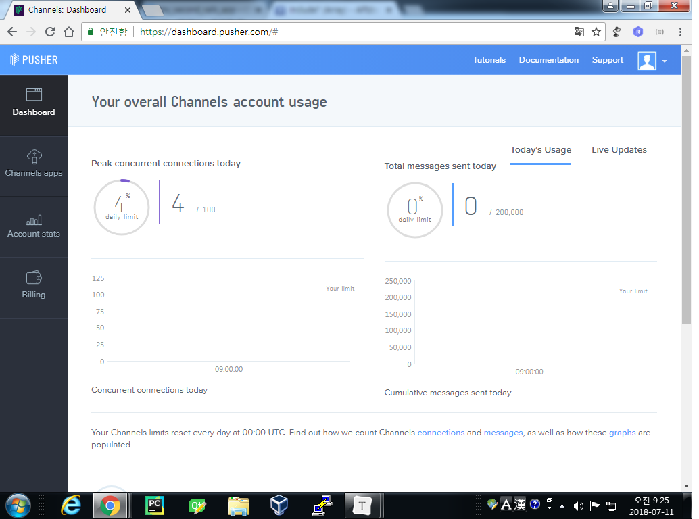

# 20180710_day21

### Pusher

- 실시간 채팅 혹은 그와 유사한 기능을 구현하기 위해 레일즈 에서는 ActionCable을 제공한다. 하지만 그보다 더 쉽게 외부 API를 이용하여 이  기능을  구현할 수 있다. 실제 ActionCable은 서버환경에 배포했을 때 더 많은 서버 셋팅을 거쳐야 하기에 pusher라고 하는 외부 API를 사용하고자 한다.




1. 필요한 Gem을 설치한다.

*Gemfile*

```ruby
# pusher
gem 'pusher'

# authentication
gem 'devise'

# key encrypt
gem 'figaro'
```

```shell
$ bundle install
$ figaro install
```

2. Devise를 설치한다

```shell
$ rails g devise:install
$ rails g devise users
```

3. 추가적으로 필요한 모델과 관계를 설정한다.

```shell
$ rails g scaffold chat_room title:string master_id:string max_count:integer admissions_count:integer
$ rails g model chat user:references chat_room:references message:text
$ rails g model admission user:references chat_room:references
```

*db/migrate/create_chat_rooms.rb*

```ruby
  def change
    create_table :chat_rooms do |t|
      t.string        :title
      t.string        :master_id 
      
      t.integer       :max_count
      t.integer       :admissions_count, default: 0

      t.timestamps
    end
  end
```

- admissions_count 는 counter_cache를 사용하기 위한 컬럼이다. 추후에 설명을 추가하도록 한다.

*db/migrate/create_chats.rb*

```ruby
  def change
    create_table :chats do |t|
      t.references      :user
      t.references      :chat_room
      
      t.text            :message

      t.timestamps
    end
  end
```

*db/migrate/create_admissions.rb*

```ruby
  def change
    create_table :admissions do |t|
      t.references      :chat_room
      t.references      :user

      t.timestamps
    end
  end
```

*app/models/chat_room.rb*

```ruby
class ChatRoom < ApplicationRecord
    has_many :admissions
    has_many :users, through: :admissions
    has_many :chats
end
```

*app/models/user.rb*

```ruby
...
  has_many :admissions
  has_many :chat_rooms, through: :admissions
  has_many :chats
...
```

*app/models/chat.rb*

```ruby
class Chat < ApplicationRecord
    belongs_to :user
    belongs_to :chat_room
end
```

*app/models/admission.rb*

```ruby
class Admission < ApplicationRecord
    belongs_to :user
    belongs_to :chat_room, counter_cache: true
end
```


##### counter_cache

[관련문서](http://guides.rubyonrails.org/association_basics.html#options-for-belongs-to)

- 1:N 관계에 있을 때 1쪽에서 N을 몇개 가지고 있는지 파악하기 위해서 a.bs.count를 사용하게 되는데 이는 하나의 쿼리를 더 실행하는 결과를 낳는다. 쿼리의 숫자를 줄여 서버의 성능을 최적화 하는 것은 매우 중요하기 때문에 레일즈에서 제공하는 counter_cache 기능을 사용하게 된다. 1:N에서 1쪽에서는 DB에 N쪽의 갯수를 저장할 컬럼을 추가해주고, N쪽에서는 association 설정에서 `counter_cache: true` 를 추가적으로 주면 된다.


4. 유저가 로그인 후 채팅방을 개설하는 코드를 작성한다. scaffold로 작성했기 때문에  일부 코드만 추가해주면 된다.

*app/views/chat_rooms/index.html.erb*

```erb
<% if user_signed_in? %>
<%= current_user.email %> / <%= link_to 'log out', destroy_user_session_path, method: :delete %>
<% else %>
<%= link_to 'log in', new_user_session_path %>
<% end %>


<hr> 

<h1>Chat Rooms</h1>

<table>
  <thead>
    <tr>
      <th>방제</th>
      <th>인원</th>
      <th>방장</th>
      <th></th>
    </tr>
  </thead>

  <tbody class="chat_room_list">
    <% @chat_rooms.reverse.each do |chat_room| %>
      <tr>
        <td><%= chat_room.title %></td>
        <td><span class="current<%= chat_room.id %>"><%= chat_room.admissions.size %></span>/<%= chat_room.max_count %></td>
        <td><%= chat_room.master_id %></td>
        <td><%= link_to 'Show', chat_room %></td>
      </tr>
    <% end %>
  </tbody>
</table>

<br>

<%= link_to 'New Chat Room', new_chat_room_path %>
```

*app/controllers/chat_rooms_controller.rb*

```ruby
  def create
    @chat_room = ChatRoom.new(chat_room_params)
    @chat_room.master_id = current_user.email
    respond_to do |format|
      if @chat_room.save
        @chat_room.user_admit_room(current_user)
        format.html { redirect_to @chat_room, notice: 'Chat room was successfully created.' }
        format.json { render :show, status: :created, location: @chat_room }
      else
        format.html { render :new }
        format.json { render json: @chat_room.errors, status: :unprocessable_entity }
      end
    end
  end
```

- 추가적으로 방이 만들어질 때, 방을 만든 현재 유저의 email이 chat_room의 속성 중 master_id로 들어가야한다.

*app/models/chat_room.rb*

```ruby
...
  def user_admit_room(user)
    # ChatRoom이 하나 만들어 지고 나면 다음 메소드를 같이 실행한다.
    Admission.create(user_id: user.id, chat_room_id: self.id)
  end
...
```

- 위 코드는 다른 유저가 이 방에 들어와서 join했을 때에도 사용할 수 있다.


5. Pusher를 사용하기 위한 설정을 추가한다.

*config/initializers/pusher.rb*

```ruby
require 'pusher'

Pusher.app_id = ENV["pusher_app_id"]
Pusher.key = ENV["pusher_key"]
Pusher.secret = ENV["pusher_secret"]
Pusher.cluster = ENV["pusher_cluster"]
Pusher.logger = Rails.logger
Pusher.encrypted = true
```

- 이 곳에서 사용된 환경변수는 `figaro gem`을 통해 만들어진 *config/application.yml* 에 지정한다.

*app/views/layout/application.html.erb*

```erb
...
  <head>
    <title>ChatApp</title>
    <%= csrf_meta_tags %>

    <%= stylesheet_link_tag    'application', media: 'all' %>
    <%= javascript_include_tag 'application' %>
    <script src="https://js.pusher.com/4.1/pusher.min.js"></script>
  </head>
...
```

*app/views/chat_rooms/index.html.erb*

```erb
...
<script>
  var pusher = new Pusher('<%= ENV["pusher_key"] %>', {
    cluster: "<%= ENV["pusher_cluster"] %>",
    encrypted: true
  });
</script>
```


6. ChatRoom과 Admission에 새로운 row가 추가될 때(create가 발생할 때), Pusher를 통해 방이 생성되는 event가 발생했다고 알린다.

*app/models/chat_room.rb*

```ruby
...
  after_commit :create_chat_room_notification, on: :create
  def create_chat_room_notification
    Pusher.trigger('chat_room', 'create', self.as_json)
    # (channel_name, event_name, data)
  end
...
```

*app/models/admission.rb*

```ruby
...
  after_commit :user_join_chat_room_notification, on: :create
  def user_join_chat_room_notification
    Pusher.trigger('chat_room', 'join', self.as_json)
    # Pusher.trigger('channel_name', 'event_name', sending data)
  end
...
```

- Pusher에 `chat_room`이라는 채널에서 `join`이라는 이벤트가 발생했음을 알리는 코드이다.  이제 *index*에서 이 채널에서 발생한 이벤트와 함께 동작하는 코드를 작성하면 된다.
- `after_commit`은 dbms에서 `commit transaction`이 발생한 이후에 메소드를 실행하는 것인데, create, update, destroy가 실행됐을 때만 사용할 수 있다.

*app/views/chat_rooms/index.html.erb*

```erb
var channel = pusher.subscribe('chat_room');
channel.bind('create', function(data) {
  console.log("방만들어짐");
});
channel.bind('join', function(data) {
  console.log("유저가 들어감");
});
```

- console에 정상적으로 로그가 찍히는 것을 확인할 수 있다. 이제  이때 동작할 function을 추가해주면 된다.

```javascript
  function room_created(data) {
    $('.chat_room_list').prepend(`
      <tr>
        <td>${data.title}</td>
        <td><span class="current${data.id}">0</span>/${data.max_count}</td>
        <td>${data.master_id}</td>
        <td><a href="/chat_rooms/${data.id}">Show</a></td>
      </tr>`);
  }
// 방이 만들어 질때, 리스트에 방 목록을 추가한다.
  
  function user_joined(data) {
    var current = $(`.current${data.chat_room_id}`);
    current.text(parseInt(current.text())+1);
  }
// 방에 들어갈 때, 현재 인원을 1 늘려준다.
```

- 처음 방이 만들어지면 현재 인원을 0을로 설정했다가, 방장이 입장하는 순간(만들어지는 동시에 방장은 해당 방에 입장하는 것으로) 0에서 1로 증가된다.


7. show에서는 채팅방 내에서 발생하는 일들을 구현한다. 유저가 처음 방에 접속하면 현재 유저 목록과 join 버튼만 보이고, 채팅 내역은 확인할 수 없다. join버튼을 누르면 해당 방에 참여되고, 해당 방에서 있었던 채팅 목록을 확인할 수 있다. 먼저 방에 참여한 사람 리스트를 만들어보자.

*app/views/chat_rooms/show.html.erb*

```erb
<p><%= current_user.email %></p>
<h3>현재 이 방에 참여한 사람</h3>
<div class="joined_user_list">
<% @chat_room.users.each do |user| %>
  <p class="user-<%= user.id %>"><%= user.email %></p>
<% end %>
</div>
<hr>
...
```

- `chat_room`과 `user`는 M:N 관계로 연결되어 있기 때문에, `@chat_room.users`와 같은 코드를 사용할 수 있다.
- 이제 이 방에 참여하게 되면 해당 방 리스트에 join한 유저를 추가해주면 된다.

```erb
<%= link_to 'Join', join_chat_room_path(@chat_room), method: 'post', remote: true %> |
<%= link_to 'Edit', edit_chat_room_path(@chat_room) %> |
<%= link_to 'Back', chat_rooms_path %>
```

- `remote: true` 속성은 해당 버튼이 동작할 때, 요청을 ajax로 바꿔준다. 우리가 기존에 공부했던 jquery 코드로 작성했던 ajax 코드를 속성하나로 줄여준다. 허무한 순간이다.

*config/routes.rb*

```ruby
  resources :chat_rooms do
    member do
      post '/join' => 'chat_rooms#user_admit_room', as: 'join'
    end
  end
```

*app/controllers/chat_rooms_controller.rb*

```ruby
...
  def user_admit_room
    if current_user.joined_room?(@chat_room)
      render js: "alert('이미 참여한 방입니다!');"
    else
      @chat_room.user_admit_room(current_user)
    end
  end
...
```

*app/models/user.rb*

```ruby
...
  def joined_room?(room)
    self.chat_rooms.include?(room)
  end
...
```

*app/models/admission.rb*

```ruby
  def user_join_chat_room_notification
    Pusher.trigger("chat_room_#{self.chat_room_id}", 'join', self.as_json.merge({email: self.user.email}))
    Pusher.trigger("chat_room", "join", self.as_json) 
  end
```

- 기존의 *admission*의 코드를수정해야한다. 각 방에서 일어나는 이벤트는 각 방에서만 발생해야 한다. 만약 모든 방이 공유하는 채널에 이벤트를 발생시키면 1번방에서 a라는 유저가 참여를 눌러도 2번방에서 a가 참여했다는 이벤트가 잘못 동작할 수 있다. 각 방별로 채널을 구분시키기 위해서 고유한 값인 id를 통해 채널을 구분하도록 한다.

*app/views/chat_rooms/show.html.erb*

```erb
<script>
  var pusher = new Pusher('<%= ENV["pusher_key"] %>', {
    cluster: "<%= ENV["pusher_cluster"] %>",
    encrypted: true
  });

  var channel = pusher.subscribe('chat_room_<%= @chat_room.id %>');
  channel.bind('join', function(data) {
    console.log("유저가 들어감");
    user_joined(data);
  });
</script>
```

- show에서도 각 방에 발생하는 이벤트를 받기 위해서 channel을 각자 방 채널로 맞춘다.

```erb
<script>
  function user_joined(data) {
    $('.joined_user_list').append(`<p class="user-${data.user_id}">${data.email}</p>`);
  }
  ...
</script>
```


**이와 같은 방식으로 각 방에서 발생하는 이벤트는 각 채널에서, 공통적인 부분은 또 다른 채널에서 이벤트가 발생할 수 있도록 구분했다. 위 방식을 응용해서 사용자가 원하는 기능을  구현해보기 바란다.**

